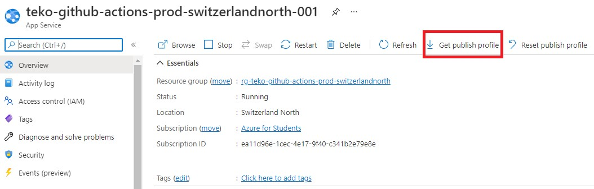

# TEKO GitHub Actions

[](https://github.com/meyerf99/teko-github-actions/actions/workflows/release.yml)

[](https://github.com/meyerf99/teko-github-actions/actions/workflows/azure-webapps-php.yml)

## Inhaltsverzeichnis

  * [Einleitung](#einleitung)
  * [Installation](#installation)
    + [Microsoft Azure App Service](#microsoft-azure-app-service)
      - [Voraussetzung](#voraussetzung)
      - [Konfiguration](#konfiguration)
    + [GitHub Actions](#github-actions)
      - [Voraussetung](#voraussetung)
      - [Konfiguration](#konfiguration-1)
        * [Automatisiertes Azure Web App Deployment](#automatisiertes-azure-web-app-deployment)
        * [Automatisiertes Release](#automatisiertes-release)
  * [Anwendung](#anwendung)
  * [Credits](#credits)

## Einleitung

In unserer Vertiefungsarbeit bei der TEKO im Fach **Programmieren Teil 1** werden [meyerf99](https://github.com/meyerf99) & [quattro99](https://github.com/quattro99) das Thema **GitHub Actions** näher erläutern.

Dieses Git Repository ist ein Bestandteil der Vertiefungsarbeit und zeigt untenstehend auf, wie das Game mithilfe von GitHub Actions zu Microsoft Azure Web App deployed werden kann und wie mithilfe eines Git Tag's ein Release erstellt wird.

## Installation

### Microsoft Azure App Service

#### Voraussetzung

- Microsoft Azure Account inkl. Subscription -> z.B. [Azure for Students](https://azure.microsoft.com/de-de/free/students/)

#### Konfiguration

Erstellung eines Microsoft Azure Web App Service mithilfe von [Azure CLI](https://docs.microsoft.com/en-us/cli/azure/).

*Beispiel*
```powershell
# Verbindung zu Microsoft Azure Tenant herstellen
az login 

# Erstellung Ressource Gruppe
az group create -l switzerlandnorth -n rg-teko-github-actions-prod-switzerlandnorth

# Erstellung App Service Plan
az appservice plan create -g rg-teko-github-actions-prod-switzerlandnorth -n asp-teko-github-actions-prod-switzerlandnorth-001 --is-linux --sku FREE

# Erstellung App im erstellten App Service Plan
az webapp create -g rg-teko-github-actions-prod-switzerlandnorth -p asp-teko-github-actions-prod-switzerlandnorth-001 -n teko-github-actions-prod-switzerlandnorth-001 --runtime "php:8.0" --https-only true
```

### GitHub Actions

#### Voraussetung

- GitHub Account
- Repository -> z.B. dieses Repository forken

#### Konfiguration

##### Automatisiertes Azure Web App Deployment

1. Wechsle auf dem GitHub Repository den Reiter zu **Actions**


2. Im Suchfeld folgendes eingeben *Deploy a PHP app to an Azure Web App* und auf *Configure* klicken


3. Dabei wird nun ein neues File *azure-webapps-php.yml* im richtigen Unterordner des Git Repository erstellt. Folgende Variablen müssen im YAML File gesetzt werden: 
    - AZURE_WEBAPP_NAME = Applikationsname -> z.B. *teko-github-actions-prod-switzerlandnorth-001*
    - PHP_VERSION = PHP Version welche verwendet wird -> z.B. *'8.0'*

    Sobald die Änderungen vollzogen wurden, kann das neue YAML File für GitHub Actions oben rechts mit *Start commit* direkt in **master** Branch commited & gepushed werden.


4. Unter *Settings* -> *Secret* -> *Actions* muss ein geheimer Schlüssel mit dem Namen *AZURE_WEBAPP_PUBLISH_PROFILE* erstellt werden. Dabei wird der Inhalt des *Publish Profile* welches auf dem Azure App Service heruntergeladen werden kann, als geheimer Schlüssel/Variable gespeichert.




5. Nun wird bei jedem Commit in **master** Branch ein automatisierter Build & Deployment zu Microsoft Azure App Service ausgelöst.


##### Automatisiertes Release

1. Der dazugehörige GitHub Action Workflow für das automatisierte Erstellen eines Releases befindet sich hier: [release.yml](.github/workflows/release.yml)

**Wichtig:**  Es wird nur ein Release erzeugt, sobald ein Tag gepushed wird.


## Anwendung

[Go and Enjoy! :smile: ](https://teko-github-actions-prod-switzerlandnorth-001.azurewebsites.net)


## Credits

- [T-Rex Runner](https://github.com/wayou/t-rex-runner)
- [Corona Runner](https://github.com/zouariste/corona-runner)
- [GitHub Actions Release](https://github.com/softprops/action-gh-release)
